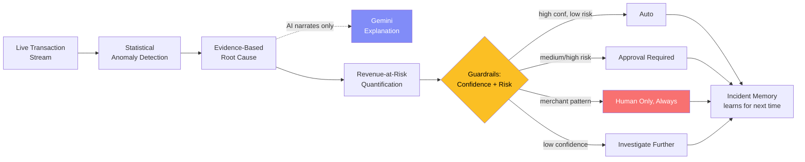

<div align="center">

# ⚡ Razorpay Pulse

### AI Payment Reliability & Revenue Intelligence Agent

**Detect → Investigate → Quantify → Recommend → Act → Learn**

[](https://razorpay-pulse.onrender.com)

[](https://github.com/Dharma718/Razorpay-Pulse/actions/workflows/ci.yml)


-brightgreen)

**Razorpay AI Buildathon — Track 03: AI Revenue Recovery**

</div>

> ⚠️ **First-time visitors:** the live demo runs on a free-tier server that sleeps after 15 minutes idle — the first load after a quiet spell can take 30–60 seconds to wake up. Once open, click **"Continue with Demo Account"** on the sign-in screen — no credentials needed, full access to every feature.

---

## The problem

Aggregate payment success rate dashboards hide the incidents that cost the most. A single bank or processor quietly failing at 40% instead of 92% barely moves an overall number — but it's a very real, very concentrated pile of lost revenue, and by the time it shows up in a top-line metric, it's often already cost real money and real trust.

**Pulse is built specifically to catch, explain, and act on exactly that blind spot** — not another "something's wrong" alert, but a full investigation loop:



## Positioning — honestly, against what Razorpay already ships

Before building this, we checked what Razorpay already has in production, because pretending otherwise would be dishonest and easy for a judge to catch:

- **RAY Concierge** already monitors 20+ critical payment metrics and alerts merchants before failures escalate.
- **Agent Studio** (launched March 2026, built on Anthropic's Claude Agent SDK) already ships production agents for abandoned cart recovery, dispute response, subscription recovery, cashflow forecasting, and settlement insights.

Pulse does not duplicate any of these. It's built for the specific gap between "the dashboard looks mostly fine" and "a specific bank/processor/region is quietly failing far worse than the aggregate suggests."

## ✨ What it actually does

| | |
|---|---|
| 🔍 **Detects the undetectable** | Checks overall *and* per-method *and* per-region deviations — a single-bank incident can be too diluted to show up in the aggregate alone |
| 🧠 **Investigates with evidence** | Region → method → provider → error code drill-down, purely from observable deviations — never peeks at ground truth |
| 💬 **Explains in plain English** | Gemini turns structured evidence into a narrative — but never decides the diagnosis or the action |
| 💰 **Quantifies honestly** | Revenue exposure is always "estimated" and "recoverable," never "saved" — nothing was actually saved in a simulation |
| 🛡️ **Gates autonomy by confidence *and* risk** | High confidence isn't enough on its own — a merchant-side pattern is never automated, no matter how sure the model is |
| 🗣️ **Takes free-form reports too** | Type, speak, or screenshot a real issue — it runs through the exact same pipeline as the preset scenarios |
| 🧾 **Remembers precedent** | Resolved incidents inform confidence and citations for the next similar one |
| 🔐 **Behaves like a real product** | Full auth (owner account + one-click demo account), not an open page |

## Guardrails (the part that should hold up under questioning)

| Confidence | Risk | Result |
|---|---|---|
| < 60% | any | **Investigate further** — never guesses, flags for manual review |
| ≥ 85% | low | **Auto** — acts without waiting |
| any | medium/high (but auto-approvable type) | **Approval required** — human must click approve |
| any | merchant-side pattern | **Human only, always** — never automated regardless of confidence |

The LLM (Gemini) is used **only** to turn structured evidence into a plain-English narrative and customer notices. The category, confidence score, and action decision are 100% deterministic code — auditable by a human, not dependent on an LLM call that could hallucinate.

## 🏗️ Architecture

```
backend/
  config.js             Baselines, thresholds, and the 4 injectable incident scenarios
  simulator.js           Generates realistic tick-by-tick transaction traffic
  investigate.js         Root-cause drill-down — region → method → provider → error code,
                          purely from observable deviations (never peeks at ground truth)
  revenue.js             Revenue-at-risk quantification with hedged recovery probability
  planner.js              Guardrails — confidence + risk jointly gate autonomy
  memory.js               Persists resolved incidents to disk for future precedent
  gemini.js                Narrative generation only — never touches the diagnosis or action
  freeform-heuristic.js     Keyword-based fallback classifier when Gemini isn't configured
  auth.js                   Password hashing (scrypt) + JWT session management
  server.js                 Tick loop orchestration + Express API
  pulse.test.js              11 unit tests
  evaluate.js                 200-trial classification accuracy benchmark

frontend/               Vanilla HTML/CSS/JS — zero build step, fast to run anywhere
  index.html / app.js        Command Center dashboard
  login.html / login.js       Auth (setup / sign-in / demo account)
```

**Data flow:** every ~2.5 seconds, the simulator generates one "tick" of transaction volume across 4 payment methods, 10 providers, and 4 regions. Once an anomaly persists for 2 consecutive ticks, the investigation engine classifies the pattern into one of `bank_degradation`, `card_processor`, `merchant_infra`, or `regional_network` — purely from evidence. The revenue engine quantifies exposure, the planner decides the autonomy tier, and the outcome is persisted for future precedent.

## 🔐 Authentication

This behaves like a real fintech product, not an open demo page.

**First-time setup:** creates one owner account (email, password, confirm password) — stored as a salted hash, never plaintext.

**Everyone else:** clicks **"Continue with Demo Account"** — no credentials needed, full read/write access to every feature. The only real difference is session length: 2 hours for demo, 7 days for owner.

## 🧪 Testing & Evaluation

```bash
cd backend
npm test        # 11 unit tests — detection, revenue math, every guardrail branch
npm run evaluate # 200-trial classification accuracy benchmark
```

Measured result on this codebase:

```
Scenario             Accuracy     Avg Confidence (correct)
--------------------------------------------------------------------------------
bank_degradation     100.0%       90.0
merchant_infra       100.0%       90.0
regional_network     100.0%       90.0
card_processor       100.0%       90.0
--------------------------------------------------------------------------------
Overall accuracy: 100.0% (200/200 trials)
```

**Honest caveat:** confidence saturates at 90% here because these test scenarios have a strong, cleanly-isolated signal. A noisier or overlapping real-world incident would be expected to produce lower, more varied confidence — which is exactly the case the `< 60% → investigate further` guardrail exists for.

## 🚀 Running it locally

```bash
git clone https://github.com/Dharma718/Razorpay-Pulse.git
cd Razorpay-Pulse/backend
npm install
cp .env.example .env    # optionally add GEMINI_API_KEY
node server.js
```

Open `http://localhost:5000`. Simulated traffic starts immediately.

## 🎬 Running the demo

1. Let it run a few seconds in the healthy state.
2. Click one of the four **scenario buttons**, or describe your own issue in the free-form box below them.
3. Watch the Investigation panel populate with evidence, confidence, and a revenue estimate within ~5–10 seconds.
4. Depending on the scenario: **Approve action** (medium risk), **"I've applied a manual fix"** (merchant-side, intentionally never automated), or it auto-resolves (low risk, high confidence).
5. Click **Dismiss** once resolved — see the full "Successfully Resolved" summary, then check **Incident Memory** at the bottom.
6. Trigger the same scenario type again — the Investigation panel now cites the prior incident as precedent.

## What's genuinely real vs. simulated

- **Real:** the statistical anomaly detection, evidence-based classification logic, revenue math, guardrail rules, and incident-memory learning loop — all deterministic, tested code.
- **Simulated:** the transaction data itself (no real Razorpay account data), and "recovery" (success rate is nudged back toward baseline when an action is approved — it isn't calling real bank APIs).

This distinction is stated explicitly and confidently — it shows judgment about what to fake and what not to, rather than overclaiming results from a simulation.

## 🛠️ Tech Stack


No frontend build step, no database — JSON-file persistence and Node's built-in test runner, deliberately kept minimal so the effort goes into the reasoning engine, not infrastructure plumbing.

---

<div align="center">

**[🔴 Try the live demo](https://razorpay-pulse.onrender.com)** · Built for the Razorpay AI Buildathon

</div>
